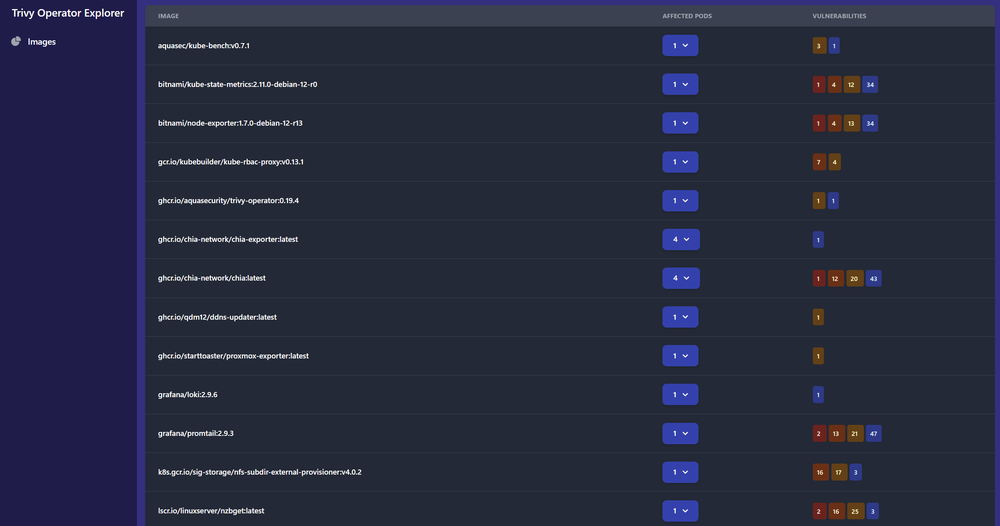
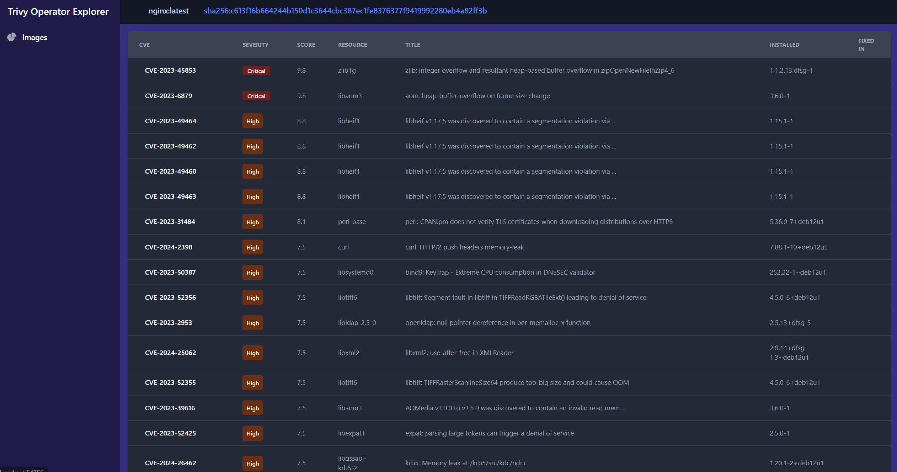

# Trivy Operator Explorer

This is a web explorer that scrapes the data exported by the [Trivy Operator for Kubernetes.](https://github.com/aquasecurity/trivy-operator) This image runs as a single binary in a distroless container image, which means it's an extremely small footprint on your cluster too.

## Preview



The main page lists each image that Trivy Operator has scanned in your cluster, provides a dropdown to show affected Pods which use that image. And enumerates a count of vulnerabilities for that image separated by severity. Red is critical, orange is high, yellow is medium, and blue is low. You can click on an image name to list all vulnerabilities, or click on a severity counter to see vulnerabilities of that severity for that image.



This is what you see when you click on an image. All the vulnerabilities are ordered by severity level, and then by score. There are multiple filters you can apply on this page, see the filter documentation below

## Install

### Pre-requisites

You will of course need [Trivy Operator](https://github.com/aquasecurity/trivy-operator) already installed. The latest version of this explorer should work with the latest version of Trivy Operator.

### Install explorer

And install the helm chart with your values file:

```bash
helm upgrade --install --create-namespace \
--repo "https://starttoaster.github.io/trivy-operator-explorer" 
-n trivy-system \
trivy-operator-explorer \
trivy-operator-explorer
```

## Filters

There are certain filters you can set when viewing the vulnerability list for an image. The filters are set with URL query parameters, which means the filters are share-able if you send a link to another person with any set. The current list of supported filters is below:

| Parameters   | Description                                                           | Example                   |
|--------------|-----------------------------------------------------------------------|---------------------------|
| hasfix       | Boolean to only view vulnerabilities that have a fix version, or not. | hasfix=true, hasfix=false |
| resources    | Comma-separated list of resources to view vulnerabilities for.        | resources=curl,zlib1g     |
| notresources | Comma-separated list of resources to ignore vulnerabilities for.      | notresources=curl,zlib1g  |
| severity     | Filter by level of vulnerability severity.                            | severity=Critical         |

Example URL: `http://your.explorer.install/image?hasfix=true&severity=Critical`

There are query parameters for image and digest as well, but it's not expected for them to be changed manually. These filters currently do not have a graphical toggle but there's a TODO item below to add some form elements to the page for them.

## TODO

- Add Role/ClusterRole vulnerabilities to the dashboard.
- Add exposed secrets scan results to dashboard.
- Add SBOM reports to dashboard.
- Add config audit reports to dashboard (reports on potentially insecure resource declarations.)
- Add cluster compliance reports.
- Graphical elements for setting filters, currently they're just URL query parameters.
- Testing. Pretty sure by law no new product can have tests.
